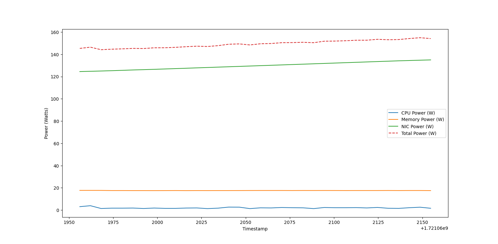

# Power Manager Telemetry

**Category:** Sustainability  

In the era of 5G and edge computing, understanding and managing power consumption across distributed systems is crucial. This project aims to provide tools and insights into system power utilization using Python.

## Overview

This repository contains a Python script `plot_power_data.py` that reads telemetry data from `utilization_log.json` and plots the power consumption of CPU, memory, and network interface (NIC). This is part of a larger project focusing on achieving net-zero power consumption and optimizing power usage in computing environments.

## Features

- **Reads Telemetry Data**: Parses JSON data from `utilization_log.json`.
- **Plots Power Consumption**: Visualizes CPU, memory, NIC, and total system power over time using matplotlib.
- **Easy to Use**: Simply run the script to generate and view the power consumption plot.

## Prerequisites

- Python 3.x
- `matplotlib` Python library
- 'psutil' Python System and Process Utilities: a cross-platform library for retrieving information on running processes and system utilization (CPU, memory, disks, network, sensors).
It provides APIs for CPU and memory usage, disk I/O, network information, and more.
Retrieves sensor data such as temperature and fan speed.
Allows management of system processes (e.g., killing processes, querying process details).

## Output

